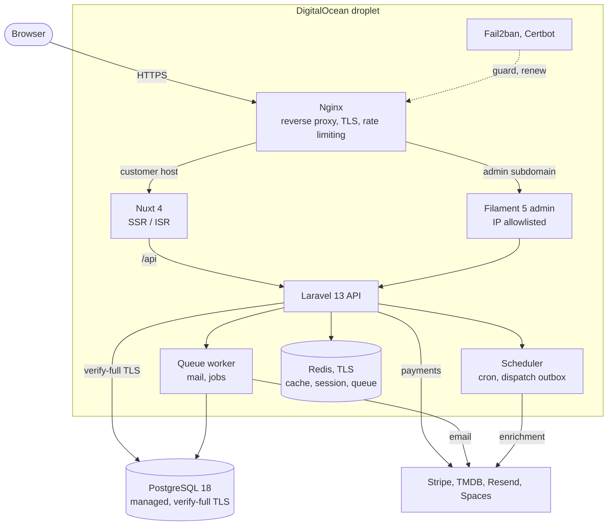

# Final Cut

[](https://github.com/ABilenduke/final-cut/actions/workflows/backend-tests.yml) [](https://github.com/ABilenduke/final-cut/actions/workflows/backend-lint.yml) [](https://github.com/ABilenduke/final-cut/actions/workflows/backend-phpstan.yml) [](https://github.com/ABilenduke/final-cut/actions/workflows/frontend-unit.yml) [](https://github.com/ABilenduke/final-cut/actions/workflows/frontend-build.yml) [](https://github.com/ABilenduke/final-cut/actions/workflows/e2e.yml) [](https://github.com/ABilenduke/final-cut/actions/workflows/codeql.yml)

A full-stack movie-theatre platform built with Nuxt 4 and Laravel 13. It runs two physical venues with real seat selection and checkout, a Filament admin panel, and a custom design system. I built it front to back: database schema, API, SPA, admin, Docker infrastructure, CI/CD, and a hardened production deploy.

## Live demo

**[thefinalcut.andrewbilenduke.com](https://thefinalcut.andrewbilenduke.com)**

You can run the whole purchase flow: pick a showtime, choose seats, add concessions, and pay. Stripe runs in test mode, so use card `4242 4242 4242 4242` with any future expiry, any CVC, and any ZIP. The booking produces a real confirmation page, a QR ticket, and a confirmation email.

## Highlights

A few parts went deeper than a typical demo.

**Seat booking is race-safe at the database level.** Reservation takes pessimistic row locks, and the booking is split into three phases so the Stripe call happens outside the DB transaction instead of holding a lock across a network round trip. A partial unique index on `(showtime_id, seat_id)`, two Postgres triggers that keep it in sync, and a `showtimes_no_overlap` EXCLUDE constraint together make it impossible for two confirmed bookings to hold the same seat, even under a race. Conflicts surface to the API as a 409.

**Customer emails survive a Redis outage.** Booking confirmations, refunds, and finance notices use a transactional outbox. The event is written in the same transaction as the booking, then a scheduled worker drains it, so a queue or Redis blip cannot silently drop a confirmation.

**TLS between every service, with an isolated admin.** Browser to nginx, nginx to backend, and backend to Postgres and Redis are all encrypted. The Filament admin runs on its own subdomain, isolated at three layers (nginx vhost, Laravel route-domain scoping, and a separate session cookie plus Redis DB), behind a fail-closed IP allowlist, rate limiting, and Fail2ban.

**A custom design system.** "The Cinematic Void Framework" is documented in full: color tokens, a typographic scale, elevation and motion rules, and a WCAG 2.1 AA contrast budget. It is implemented in plain CSS custom properties and shared between the Nuxt app and the Filament admin theme.

**Money is integer cents, never a float,** from the schema to the API response.

**It deploys from a git tag.** Tagging a version builds the images, pushes them to GHCR, and deploys over SSH to a DigitalOcean droplet, with Let's Encrypt and automatic renewal.

## Tech stack

| Layer | Tools |
| --- | --- |
| Frontend | Nuxt 4, Vue 3, TypeScript, token-driven CSS, Stripe.js, Deno runtime |
| Backend | Laravel 13, PHP 8.4, Sanctum, Stripe PHP SDK |
| Admin | Filament 5, spatie/laravel-permission (RBAC), spatie/laravel-activitylog (audit trail) |
| Data | PostgreSQL 18 (TLS, verify-full), Redis (TLS) for cache, session, and queue |
| Infrastructure | Docker Compose, Nginx, Fail2ban, Certbot and Let's Encrypt, Mailpit (dev mail), DigitalOcean Spaces |
| Quality | Pest, Vitest, Playwright, PHPStan, Laravel Pint, CodeQL, GitHub Actions |
| External | Stripe (payments), TMDB (movie data), Resend (email) |

## Architecture

The frontend calls the Laravel API directly; there is no Nuxt BFF. Stripe and TMDB calls live in the backend, so the client bundle holds no secrets. TMDB is used only as offline enrichment, never in the request path.



A tagged push (`vX.Y.Z`) runs GitHub Actions, which builds the backend and frontend images, pushes them to GHCR, then SSHes to the droplet to pull, migrate, optimize, and health-check. See [docs/runbooks/production-deploy.md](docs/runbooks/production-deploy.md).

## Features

Customer app:

- Cross-location movie catalog (Now Showing and Coming Soon), with TMDB-enriched detail pages showing cast, trailers, and showtimes grouped by venue.
- Seat selection on an interactive auditorium grid (keyboard-navigable, WCAG roving-tabindex), then food pre-order, Stripe checkout, a QR ticket, an `.ics` download, and an emailed confirmation.
- Guest checkout and accounts (loyalty points and tiers, order history, saved payment methods).
- A "What's On" calendar, events, gift cards (purchase and balance lookup), a food and drink menu, multi-location pages with geolocation-aware ordering, a blog, and editorial content pages.
- Per-route ISR and SSR rendering, a sitemap, structured data, and OpenGraph tags.

Admin panel (Filament 5, admin subdomain, IP-allowlisted):

- Movies and TMDB enrichment, showtimes with conflict detection, locations, auditoriums and seats, bookings and lookup, customers and loyalty, menu, promo codes, gift cards, calendar events, and CMS-managed site content.
- Role-based access (admin, manager, ops, plus granular permissions) and a full activity-log audit trail.

## How a few things work

<details>
<summary>Booking concurrency and seat integrity</summary>

Seats are reserved with `lockForUpdate`, and the booking lifecycle is split into three phases so the Stripe network call happens outside the DB transaction and lock. Correctness is then guaranteed by the database, not only by application code:

- a denormalized `booking_seats.occupies_seat` boolean kept in sync by two Postgres triggers,
- a partial unique index `(showtime_id, seat_id) WHERE occupies_seat`, the authoritative "one occupant per seat" guarantee, surfaced to the API as a 409 SeatConflict,
- a `showtimes_no_overlap` EXCLUDE constraint that prevents overlapping showtimes in one auditorium,
- a scheduled `bookings:expire-held` sweep that releases seats orphaned by a crash mid-checkout.

</details>

<details>
<summary>Transactional dispatch outbox</summary>

Instead of firing a queued job (and hoping Redis is up) when a booking is finalized, the app writes a `dispatch_outbox` row inside the finalize transaction. A scheduled `outbox:dispatch` (every minute, with `withoutOverlapping`) maps `event_type` to a job and enqueues the real work, with pruning aligned to the activity-log retention window. Customer-facing side effects like confirmations and refund notices stay durable across infrastructure failures.

</details>

<details>
<summary>TMDB as offline enrichment</summary>

The theatre owns its catalog. Movies are created locally with an optional `tmdb_id`, and a scheduled `movies:enrich` command backfills synopsis, cast, images, trailers, and ratings into Postgres (cached 24 hours on success, 5 minutes on failure). API responses serve only local data, so a TMDB outage or rate limit cannot slow or break a page load.

</details>

<details>
<summary>Production deploy and hardening</summary>

Multi-stage Dockerfiles with separate production and development targets, a GHCR registry overlay, managed Postgres over verify-full TLS, a Redis container with its own CA, Let's Encrypt issuance and renewal via a certbot sidecar, a non-root deploy user, disabled root SSH and password auth, and a DigitalOcean Cloud Firewall. A release is one `git tag` and `git push`.

</details>

## Testing

Spec-first and test-driven, with a zero-failing-tests policy. Every endpoint, service, component, and user flow is covered.

| Suite | Tool | Scale |
| --- | --- | --- |
| Backend (unit and feature) | Pest | ~1,394 tests across 159 files |
| Frontend (unit and component) | Vitest with @nuxt/test-utils | ~1,002 tests across 125 files |
| End to end | Playwright | 366 tests across 13 specs |

On top of that: PHPStan static analysis, Pint formatting, CodeQL security scanning, and architecture guard tests that pin invariants like route-domain isolation and the auth mechanism. CI runs all of it on every push and pull request.

## Running it locally

Requires Docker and Docker Compose. The dev environment is fully containerized (Nuxt, Laravel, Postgres, Redis, Nginx, Mailpit, Fail2ban) with TLS between services.

```bash
make certs        # generate local SSL certs (run once)
make trust-cert   # trust the CA on Windows (WSL2 only, optional)
make up           # start the full stack
make fresh        # migrate and seed demo data
```

App at `https://finalcut.test`, admin at `https://admin.finalcut.test`, captured mail at `http://localhost:8025`. On WSL2, add both hostnames to your hosts file.

```bash
make test            # backend and frontend
make test-backend    # Pest
make test-frontend   # Vitest
make e2e             # Playwright
```

The suite needs no Stripe or TMDB keys: payments use a FakeStripeService and TMDB is offline only. The full command reference is in [CLAUDE.md](CLAUDE.md).

## Project structure

```text
final-cut/
├── frontend/            Nuxt 4 SPA (app, tiered components, composables, pages)
├── backend/             Laravel 13 API and Filament admin (Actions, Services, Models, Filament)
├── nginx/               reverse-proxy vhost templates, TLS, rate-limit zones
├── docker-compose*.yml  base plus dev, prod, registry, e2e, and stack overlays
├── .github/workflows/   CI (lint, PHPStan, tests, e2e, CodeQL) and release pipeline
└── docs/                architecture, design system, specs, plans, runbooks
```

## Documentation

The repo is documented like a real product:

- [docs/architecture/](docs/architecture/): site architecture, data models and API inventory, state management, content architecture.
- [docs/design-system/](docs/design-system/): "The Cinematic Void Framework" tokens, typography, layout, motion, and accessibility.
- [docs/specs/](docs/specs/): component inventory, page specs, and the purchase-flow spec.
- [docs/runbooks/](docs/runbooks/): production deploy and admin operations.

## About

Built solo by Andrew Bilenduke as a portfolio project. I designed, architected, implemented, tested, and deployed it front to back, with conventional commits and spec-driven development throughout.

Contact: [GitHub](https://github.com/ABilenduke), [LinkedIn](https://www.linkedin.com/in/andrew-bilenduke-8633118a), [andrewbilenduke@gmail.com](mailto:andrewbilenduke@gmail.com).

Licensed under the [MIT License](LICENSE).

Final Cut is a fictional cinema. Payments run in Stripe test mode. Movie metadata comes from TMDB; this product uses the TMDB API but is not endorsed or certified by TMDB.
